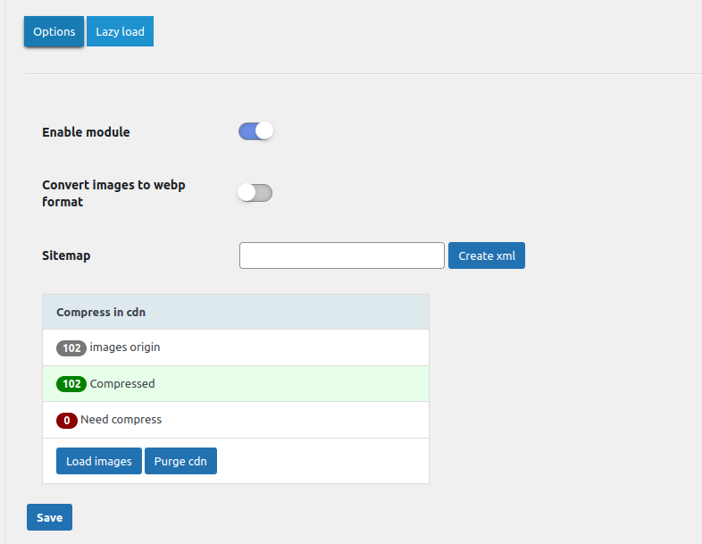
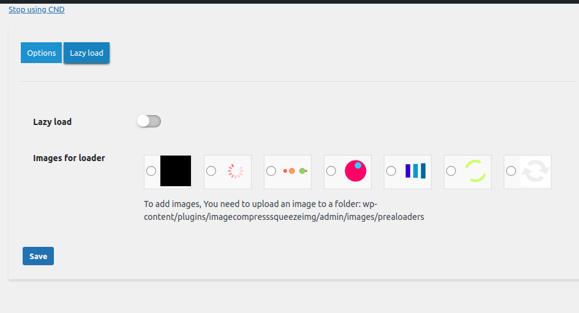

=== Compress Images with Squeezeimg (Webp/Jp2/Avif) ===
Contributors: squeezeimg
Donate link: https://squeezeimg.com/
Tags: image, compress, convert, optimize, Squeezeimg
Requires at least: 4.0.1
Tested up to: 5.8.5
Stable tag: 1.0.8
License: GPLv2 or later
License URI: http://www.gnu.org/licenses/gpl-2.0.html

Optimize your website's images and improve performance with this plugin. It compresses images and converts them to Webp, Jp2, and Avif formats.

== Description ==

The "Compress Images with Squeezeimg (Webp/Jp2/Avif)" plugin leverages Squeezeimg Image Optimizer's powerful features to minimize your images' size without noticeable quality loss. It supports compression and conversion of popular image formats, including PNG, JPG, JPEG, GIF, SVG, BMP, and TIFF, to WebP, AVIF, and JP2.

This plugin communicates with the Squeezeimg service, which processes images to reduce their size and optimize performance. By using this plugin, your image data will be sent to and processed by Squeezeimg's servers.

Key features include:
– **Fast Compression**: Reduce image sizes by 50-80%, improving loading times.
– **Modern Formats**: Convert images to WebP, AVIF, and JP2, reducing sizes by approximately 50% compared to original.
– **Selective Compression**: Apply compression or conversion to specific folders, optimizing usage limits effectively.
– **Free Usage Tier**: Compress and convert up to 1,000 images per month for free. More extensive plans available.
– **Lazy Load Integration**: Defer loading of images to further speed up interactions.
– **SEO Enhancement**: Automatically generate and submit a complete image sitemap to search engines like Google and Yandex.
– **CRON Automation**: Set up automatic image processing to save time and ensure your website is always optimized.

For a quick start, watch our setup tutorial: https://youtu.be/GcVux_xFxf0

== Installation ==

1. Download and install the plugin via WordPress plugin directory or upload the entire "Compress Images with Squeezeimg" folder to the `/wp-content/plugins/` directory.
2. Activate the plugin through the 'Plugins' menu in WordPress.
3. Register at https://squeezeimg.com and generate your API key.
4. Enter the API key in the plugin's settings page.
5. Choose your desired image compression and conversion settings.
6. Optionally, enable Lazy Load and specify folders for selective compression.

== Frequently Asked Questions ==

= What formats can I optimize? =
You can optimize PNG, JPG, JPEG, GIF images and convert them to WebP, AVIF, and JP2 formats.

= How does the free plan work? =
The free plan allows you to optimize up to 1,000 images per month. Unused quotas do not carry over to the next month.

= Can I restore the original images? =
Yes, the plugin can keep copies of the original images, allowing you to restore them if needed.

= Is it suitable for large websites? =
Yes, with advanced settings and CRON support, it's perfect for large websites needing regular image optimization.

= What are the server requirements? =
The plugin works on servers running Apache2 or Nginx. It is not compatible with Microsoft IIS without the Rewrite module enabled.

= What are the terms and policies of the service? =
You can find more information about Squeezeimg's terms of use and privacy policy here:
– [Squeezeimg Terms of Use](https://squeezeimg.com/page/software-service-agreement)
– [Squeezeimg Privacy Policy](https://squeezeimg.com/page/privacy-policy)

== Changelog ==

= 1.0.8 =
* Added CDN image compression support.

= 1.0.7 =
* Fixed bug with WP version validation.

= 1.0.6 =
* Fixed issue where conversion could stop unexpectedly.

== Upgrade Notice ==

= 1.0.8 =
* We recommend upgrading to take advantage of CDN compression features.

== Screenshots ==
1. Main settings page of the plugin.
   
2. Example of optimized images in the media library.
   

== Additional Resources ==
* [Squeezeimg Pricing Plans](https://squeezeimg.com/pricing)
* [Plugin Support](mailto:info@squeezeimg.com)
